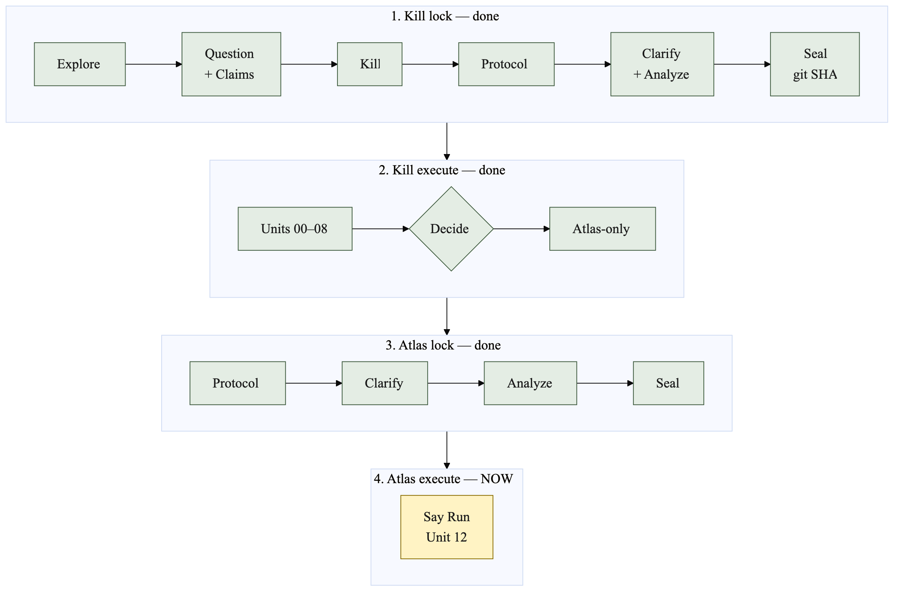
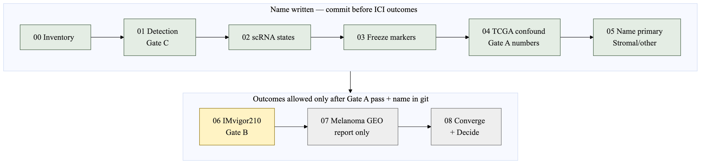

# SEAL flow — what order, what to run

Look here when the sequence is unclear. **You are here** is always `STATUS.md`. Today: Gate A **pass**; primary **Stromal/other**. **Say `Run` for Unit 06** (IMvigor210 Gate B).

Generic kernel: [`.seal/E2E_FLOW.md`](../.seal/E2E_FLOW.md). This study: [`E2E_FLOW.md`](../E2E_FLOW.md). Chat cheat-sheet: [`.seal/workflows.md`](../.seal/workflows.md).

## The loop

Green = finished. Yellow = current. Grey = later.

## This study’s units

Do not open IMvigor210 or GEO **outcome** files until Unit 05 is in git (Gate A is marked pass).

| Say in chat | When | What happens |
|---|---|---|
| **Run** | After Seal, one unit at a time | Agent executes the current unit in `STATUS.md` |
| **Unit** | Packet missing or wrong | Writes/updates `units/<id>.md` only |
| **Converge** | After Unit 08 outputs exist | Check results against the sealed protocol |
| **Decide** | After Converge | You pick stop / atlas-only / full paper |
| Explore / Question / Kill / Protocol / Clarify / Analyze / Seal | Already done | Do not re-open unless a dated amendment |

OSF prereg can go up any time after the git SHA. It is not a Unit 01 blocker. Spark is after Decide, full-paper path only.

## What to run right now

Stay on this laptop. Primary is **Stromal/other**. Gate A **pass**. Commit `research/05-primary-state.md`, then say `Run` for Unit 06.