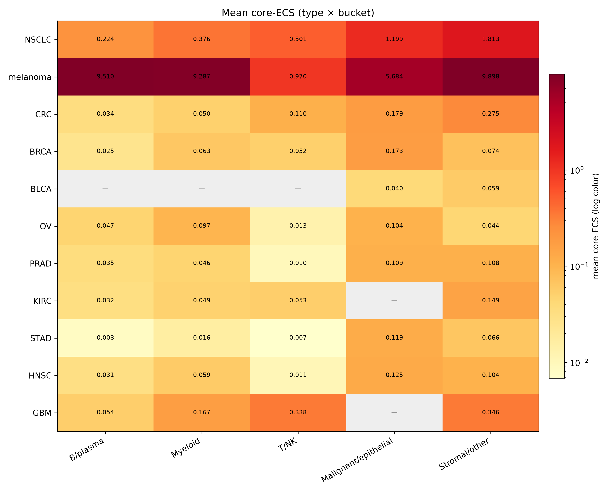
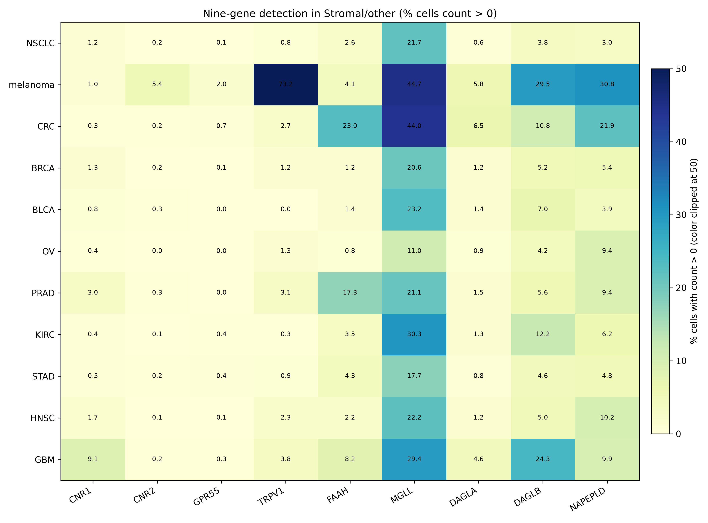
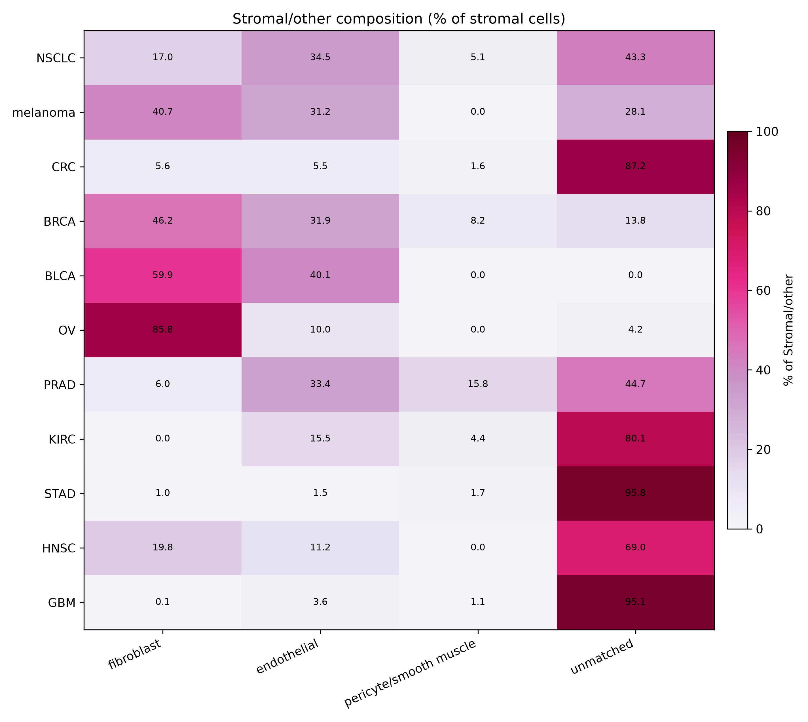

# Named lineage cell states of the human tumor endocannabinoidome

Chad Auld  
Correspondence: chadauld+osf@gmail.com 
Repository: https://github.com/cauld/scendo  
License: [CC BY 4.0](../LICENSE)

**SCENDO atlas paper.** Core five-type map plus Census expansion; frozen ICI chapter reported negative. Confirmatory numbers: [`RESULTS.md`](../RESULTS.md). Claims ceiling: [`CLAIMS.md`](../CLAIMS.md). Protocol freeze: kill git `3fbf310` (2026-08-24); atlas git `2a74270`.

## Abstract

The human endocannabinoid system (ECS) is often summarized as “CB1 in brain, CB2 in immune cells.” We asked where a locked nine-gene ECS list actually sits in public human tumor single-cell RNA, and whether a **frozen** non-B cell-state score associates with immune-checkpoint **response** after B-cell, tertiary lymphoid structure (TLS), and CD8 adjustment.

On CELLxGENE Census (`2025-11-08`) and a pinned BLCA fallback, three lineage buckets carry an ECS state: **B/plasma**, **Malignant/epithelial**, and **Stromal/other**. The primary display name is **Stromal/other**, chosen before any ICI outcome file was opened. In bulk TCGA the nine-gene score is distinguishable from B-cell and TLS abundance (|r| < 0.6 in pooled n=3664 and in TCGA-BLCA n=426). A locked 12-type Census expansion adds six types with the same tables and skips six with a documented reason. Myeloid and T/NK catalog rows are not confirmatory named states. Stromal subtypes are display only.

The same frozen Stromal/other score **does not** associate with atezolizumab response in IMvigor210 after B + TLS + CD8 (Model 1 n=298, ECS OR 1.189, 95% CI 0.551–2.563). Overall survival, unadjusted models, a TMB/PD-L1 robustness fit, and two small melanoma GEO sets do not carry this claim. This is a named-state map with a frozen negative ICI chapter. It is not a test of cannabis therapy and does not show that CB2 is a clinical checkpoint.

## Introduction

Where the ECS sits in human tumors is easy to slogan and hard to locate. Receptor-and-enzyme lists are short; public single-cell atlases are large; *CNR2* in bulk tumor RNA can track B cells, and B cells / TLS already predict checkpoint outcomes in several cancers. A map without that confound is a resource. An ICI signature without a map is another *CNR2* Kaplan–Meier.

This paper reports the atlas-only path of a pre-specified kill test. Gate A asked whether ECS signal exists in more than one lineage and whether a non-B state is distinguishable from B-cell / TLS abundance. Gate B asked whether a **frozen** non-B score associates with IMvigor210 **response** after B + TLS + CD8. Gate A passed. Gate B failed. The decision was to write the map and report the ICI chapter as negative, not to hunt a new ICI model.

We do not claim that cannabis or CBD/THC treats cancer, that patients should change cannabis during PD-1 blockade, or that CB2 **is** an immune checkpoint in the clinical sense.

## Results

### A nine-gene ECS is detectable as lineage means, not as a *CNR2*-only slogan

The confirmatory gene list is `CNR1, CNR2, GPR55, TRPV1, FAAH, MGLL, DAGLA, DAGLB, NAPEPLD`. Neighbor genes stay out of the score. scRNA scores are available-case means of **raw counts** inside existing lineage labels (no new clustering, no NMF, no DE). A lineage has an ECS state in a cancer type if at least one core gene is detected (count > 0) in ≥5% of that lineage’s cells and the lineage mean is highest or second-highest among non-empty buckets, after a B-lineage contamination screen (`MS4A1`, else `CD19`, else `CD79A`; ≥10% drops a non-B lineage in that dataset).

On the five core types (NSCLC, melanoma, CRC, BRCA from Census; BLCA from pinned TISCH2+GEO `GSE130001`), detection of *CNR2*, *MGLL*, and *FAAH* is not uniformly dark in every non-B lineage. The map is tables (and heatmaps of those tables). There is no UMAP, Harmony, or scVI atlas in this protocol.

### Three named states; primary is Stromal/other

After the ECS-state rule and contamination filter, the buckets with an ECS state are **B/plasma** (melanoma), **Malignant/epithelial** (BLCA, BRCA, CRC, NSCLC), and **Stromal/other** (all five). Re-running the core catalog on the same pins reproduced those three buckets with no kept↔dropped flip and no numeric drift at published precision.

Both non-B buckets qualify on bulk confound tests. Pooled TCGA (n=3664) Pearson r vs B-cell signature = 0.417 and vs TLS = 0.383; TCGA-BLCA (n=426) r_B = 0.361 and r_TLS = 0.263. Residualization was not used. Because bulk TCGA scores the same nine genes for every non-B candidate, the first cascade step is a tie; **Stromal/other** was named primary because it met the ECS-state rule in all five core types (vs four for Malignant/epithelial). That name was committed before IMvigor210 or GEO phenotypes were opened. Gate B always uses the continuous **raw** nine-gene score.

### Expansion is pre-specified, not shopped

Twelve expansion types were locked before cell counts were used to include or skip. Census only; skip if the type is missing or n < 10,000 after the same primary-data filter as the core map. No substitute type. No new TISCH2 dataset.

Six types were tabled: OV (n=984,988), PRAD (68,322), KIRC (187,792), STAD (217,923), HNSC (82,378), GBM (1,363,983). Six were skipped: PAAD, ESCA, UCEC, THCA, CESC (missing in Census) and LIHC (n < 10,000). Near-miss labels (generic RCC, liver cancer, non-adenocarcinoma pancreas) were not added.

On expansion tables, Malignant/epithelial and Stromal/other continue as the same confirmatory **named** states. Myeloid (OV) and T/NK (GBM, KIRC) can meet the catalog ECS-state rule; those rows stay catalog-only and are not new named states. The primary remains **Stromal/other**.

Mean core-ECS by type and lineage bucket:

Nine-gene detection inside Stromal/other:

### Stromal/other is a bucket, not a fibroblast paper

Among cells already assigned to Stromal/other, existing Census or TISCH2 labels were grouped as fibroblast, endothelial, pericyte/smooth muscle, or unmatched. That table is a confirmatory *output*. It is not a new confirmatory state and does not rename **Stromal/other**.

Composition varies by type (fibroblast-rich in OV, BLCA, BRCA; unmatched-heavy in STAD, GBM, CRC, KIRC). Unmatched names are the labels the atlas already had (for example `unknown`, microglia, stem cell). They are not clustered into a fourth named state.

### Frozen IMvigor210 test does not associate with response after B, TLS, and CD8

The confirmatory ICI result is IMvigor210 Model 1, copied from the kill run. n = 298 complete cases (68 CR/PR, 230 SD/PD). Nine of nine ECS genes were present. Logistic model: `response ~ ECS + B_cell + TLS + CD8`.

| Term | OR | 95% CI |
|---|---:|---|
| ECS (Stromal/other) | 1.189 | 0.551–2.563 |
| B cell | 0.961 | 0.495–1.863 |
| TLS | 0.517 | 0.258–1.035 |
| CD8 | 2.380 | 1.508–3.757 |

The ECS interval includes 1. VIF(ECS) = 1.360 (< 3), so collinearity of ECS with the confounders is not the reason the interval includes 1. CD8 associates with response in the same model; that does not pass an ECS checkpoint claim.

Unadjusted ECS OR 1.076 (0.568–2.038), Model 2 n=234 ECS OR 1.093 (0.449–2.663), and Cox OS n=348 ECS HR 0.898 (0.623–1.294) are secondary. Two pre-treatment melanoma GEO sets (GSE78220 n=26, ECS OR 0.469, 0.019–11.697; GSE91061 n=49, ECS OR 0.603, 0.066–5.510) are underpowered replication. None of these can carry or rescue the confirmatory claim. Deconvolution was not run. No cutoff was searched.

## Discussion

The paper is the map. Human tumor ECS, on this nine-gene list, is visible as lineage cell states rather than as a single-gene slogan. **Stromal/other** is a non-B state that passes the pre-specified B-cell / TLS confound tests. A frozen score of that state does **not** associate with IMvigor210 response after B + TLS + CD8.

That negative is complete, not a prelude to fishing. Melanoma GEO does not “validate a biomarker.” OS and unadjusted fits are not a checkpoint association. Myeloid and T/NK catalog rows in expansion types are not a fourth and fifth named state. Fibroblast vs endothelial counts inside Stromal/other are display.

Limitations follow the lock. Expansion is Census-only; six locked types are skipped rather than filled from another database. Melanoma core n is small relative to BRCA or NSCLC. Stromal/other includes unmatched labels by design. There is no embedding, no browser, and no causal test of CB2. Neighbor enzymes and receptors were not added after seeing outcomes.

What this study may still say is listed in `CLAIMS.md`: cell states, a non-B state distinct from B/TLS abundance, and a frozen negative IMvigor210 response test. What it may not say: cannabis as therapy; CB2 as a clinical checkpoint; a practice change during PD-1.

## Methods

**Protocols.** Kill confirmatory methods: [`PROTOCOL.md`](../PROTOCOL.md) (git `3fbf310`). Atlas completeness and frozen ICI citation: [`PROTOCOL-ATLAS.md`](../PROTOCOL-ATLAS.md) (git `2a74270`). Pass/fail: [`KILL.md`](../KILL.md), [`KILL-ATLAS.md`](../KILL-ATLAS.md). Operator notes: `research/`.

**scRNA.** CELLxGENE Census human RNA, version `2025-11-08`, `is_primary_data == True`, culture/organoid/cell-line drop as in the detection unit. One cancer type per query. BLCA fallback is TISCH2 `BLCA_GSE130001` cell types matched to GEO `GSE130001` counts. Lineage buckets are a locked substring map on existing labels (B/plasma, myeloid, T/NK, malignant/epithelial, stromal/other). Cell score = available-case mean of the nine core genes on raw counts (min 7/9).

**Bulk confound.** TOIL `tcga_RSEM_gene_tpm` as shipped. Within-window gene-wise z-scores; available-case mean. B-cell list `MS4A1, CD19, CD79A, CD79B, MZB1`; TLS `CXCL13, CCL19, CCL21, CCR7`. Pearson |r| < 0.6 in pooled TCGA and TCGA-BLCA.

**ICI.** IMvigor210 from `IMvigor210CoreBiologies_1.0.1` `cds` object. DESeq size-factor normalized counts, `log2(norm + 1)`, within-cohort z-scores, available-case mean. Endpoint `binaryResponse` CR/PR vs SD/PD; drop NE/NA. Model 1 logistic as specified. VIF from OLS auxiliary regressions on the four scores. GEO GSE78220 and GSE91061: pre-treatment anti-PD-1 melanoma, `log2(FPKM + 1)` then the same scoring; Model 1 if covariates exist. No new ICI cohort, gene, cutoff, or refit in the atlas phase.

**Figures.** Heatmaps are of the confirmatory type × lineage tables and of the display-only stromal composition table. No embedding.

## Data and code

Public data only. Census, TISCH2/GEO BLCA, TCGA/TOIL Xena, IMvigor210, GSE78220, and GSE91061 remain under their original licenses. Pipeline: `pipeline/` in this repository (Python, [uv](https://docs.astral.sh/uv/)). Study text is CC BY 4.0. Confirmatory freeze SHAs are recorded in [`STATUS.md`](../STATUS.md).

Reproduce: `uv sync`, then the unit runners under `pipeline/` (`inventory_00.py` … `figures_13.py`). Large data files are gitignored (`data/`). Pins and checksums: [`research/data-inventory.md`](../research/data-inventory.md).

## Competing interests

The author declares no competing interests. Confirm before a journal or preprint click.

## References (datasets)

- CELLxGENE Census, version `2025-11-08` (CZI).  
- TISCH2 `BLCA_GSE130001` cell types with GEO `GSE130001` counts.  
- TOIL TCGA `tcga_RSEM_gene_tpm` via Xena.  
- Mariathasan et al., IMvigor210 (`IMvigor210CoreBiologies` 1.0.1).  
- Hugo et al., Cell 2016, GEO GSE78220.  
- Riaz et al., Cell 2017, GEO GSE91061.
